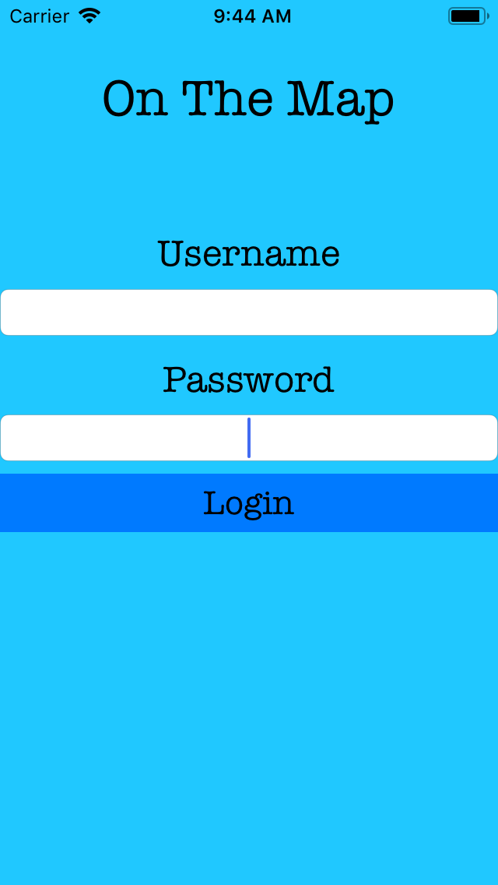
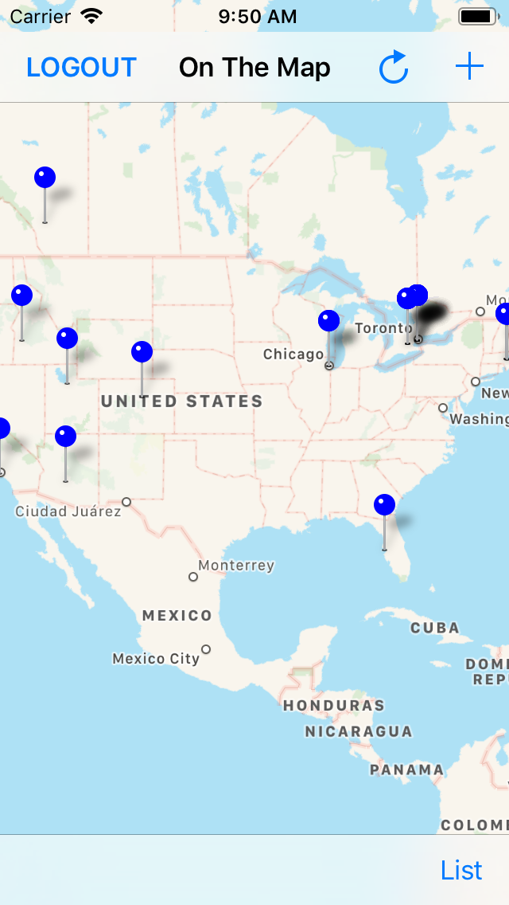
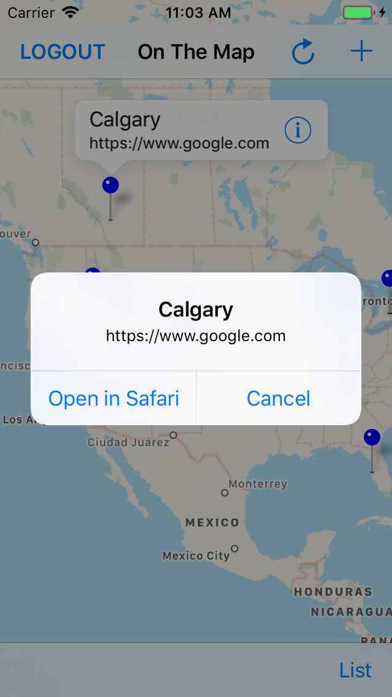
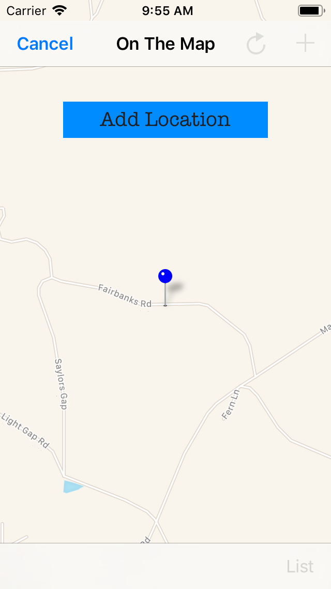
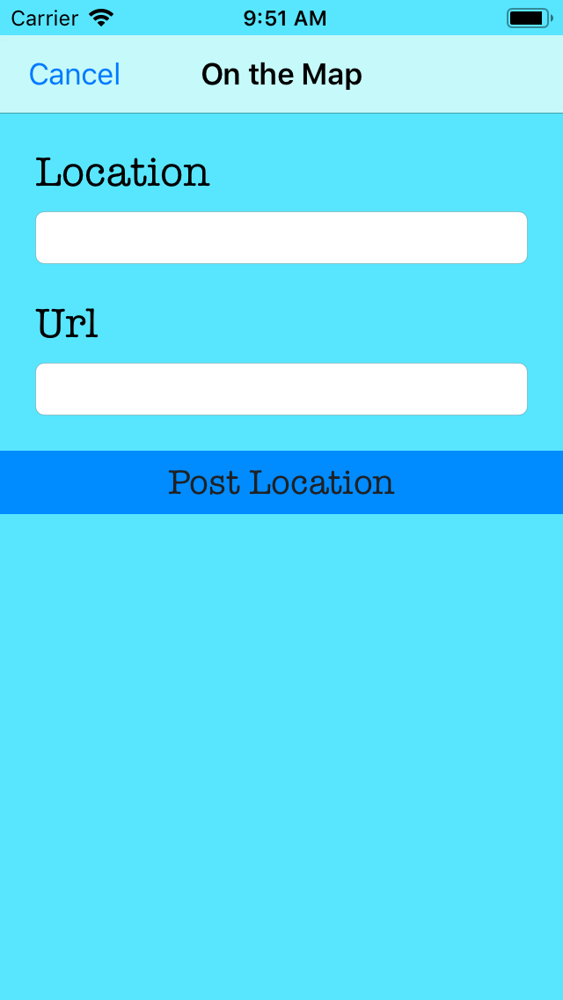
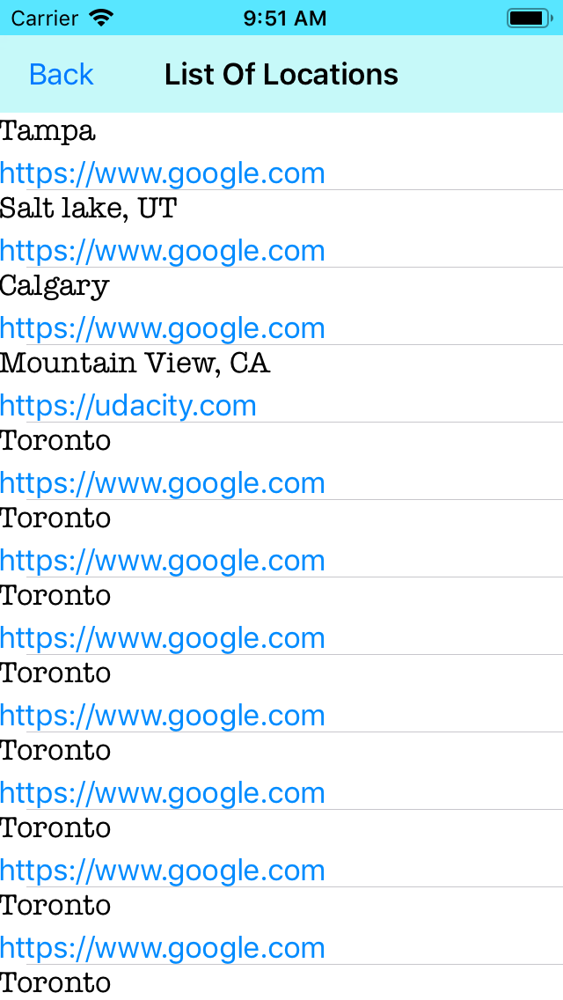
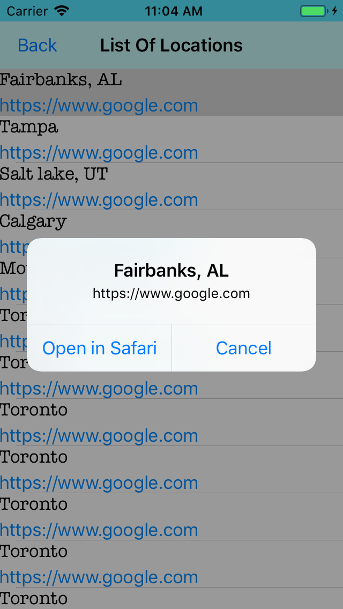
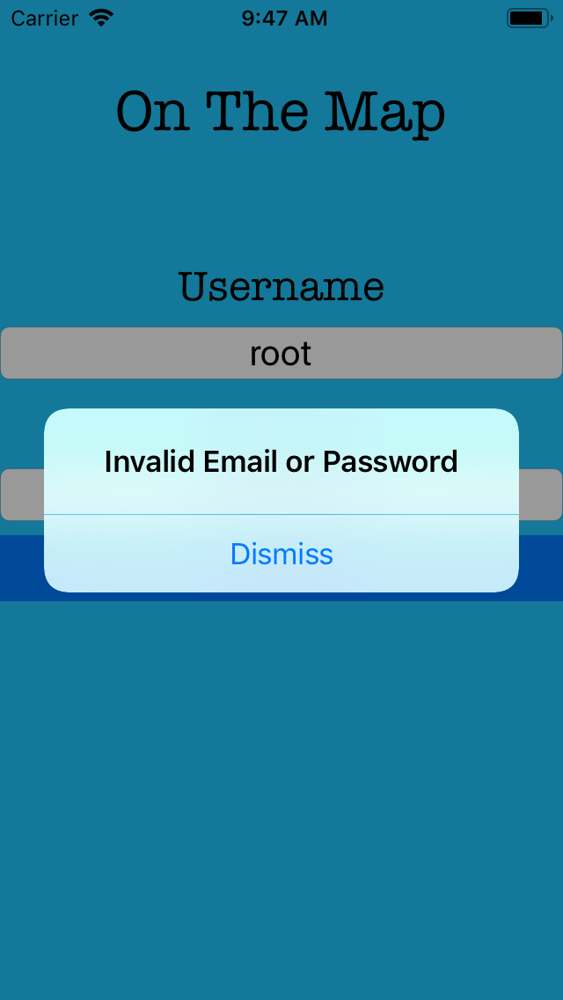
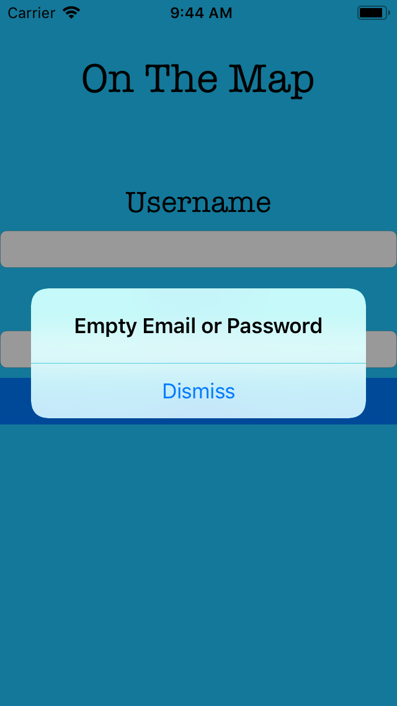

# On the Map

#### IOS app that allows a user to post locations containing a url. As well as view other users postings within a MKMapView

---

## ViewControllers

During a network request activity indicators are used to help display that the app is currently active.

### LoginViewController

Allows a user to login through a post request with user data from two text fields. Session ID and key is returned from the post request and stored.

Contains:
1. Two text fields allows users to enter credentials to Udacity's login API.
2. A single button executes the POST request sending credentials to the server.



### MapViewController

Contains:
1. Navigational bar with three buttons; logout, refresh and add a pin.
2. Tool bar button that switches to a TableViewController.
3. MKMapView with clickable annotations (Pins) are displayed with user information.

Users can view locations on the MKMapView, each location is represented by a pin. When a pin is selected location and url will be displayed with a disclosure button. Pressed again, alert will be presented asking if the url should be opened in Safari.

Logout button will perform a delete request with session data and then taken back to the LoginViewController. This button is also used to cancel when creating a pin by changing the button title and tag.

#### getPins function

"getPins" function is used within the view did load and the refresh button. Responsible for performing a get request for the last 100 student locations and populating the StudentLocation array and MKMapView.








### AddPinViewController

Contains:
1. Two text fields allow user to enter a Location and url.
2. Single button executes a delegate to mapView with location and url data.
3. Navigational bar button cancels pin creation.

When location and url have been entered and button is pressed, geocoding of the location will return coordinates. If successful, a delegate is triggered passing coordinates, location and url to MapViewController. These Coordinates are then used on the map to display the location allowing the user to verify. Cancel button allows a user to go back to the MapViewController.



### TableViewController

Contains:
1. Navigational bar with a single back button
2. 100 cells of user locations

 A simple segue is used from the MapViewController to enter TableViewController. Each cell contains two labels to display the location and url. When a cell is selected an alert will be present asking if the url should be opened in Safari.





---

## ErrorHandling

Contains:
1. Custom errors kept in enums
2. Extension alert function
3. Guard throwable functions


Code is kept clean by errors separate from the viewControllers





#### Custom errors allow for friendlier messages.

```js
enum loginError: Error {
    case empty
    case invalidJson
    case invalidJsonFromUser
    case invalidAccount
    case invalidServer
    case invalidConnection
}

extension loginError: CustomStringConvertible {
    var description: String {
        switch self {
        case .empty: return "Empty Email or Password"
        case .invalidJsonFromUser: return "Internal Error"
        case .invalidJson: return "Unable to read message from server."
        case .invalidAccount: return "Invalid Email or Password"
        case .invalidServer: return "Server offline"
        case .invalidConnection: return "Unable to connect to server"
        }
    }
}

```

#### A single alert function displays the error to the user.
```js

extension Error {

    func alert(with controller: UIViewController) {
        let alertController = UIAlertController(title: nil, message: "\(self)", preferredStyle: .alert)
        let okAction = UIAlertAction(title: "Dismiss", style: .default, handler: nil)
        alertController.addAction(okAction)
        controller.present(alertController, animated: true, completion: nil)
    }
}
```
#### Throwable functions with guard statements allow for reuse between views.

```js
// Checks data, response and error is nil
func noResponse( data:Data?,response:URLResponse?,error:Error?) throws {
    guard data != nil else {throw loginError.invalidConnection}
    guard response != nil else {throw loginError.invalidConnection}
    guard error == nil else {throw loginError.invalidConnection}
}

// Check user credentials login within loginviewcontroller
func submit(Username:String,Password:String)throws{
    guard Username != "" else {throw loginError.empty}
    guard Password != "" else {throw loginError.empty}
}

// Check user pin information is not empty within AddPinviewcontroller
func noPinData(userLocation:String?,userUrl:String?) throws {
    guard userLocation != "" else {throw pinError.empty}
    guard userUrl != "" else {throw pinError.empty}
}
```


---

## Request

### Endpoints

Endpoints are constructed using a structs and URLComponents. This system allows for a query to be added and kept separate from the viewControllers.

```js
struct onTheMapEndpoint {
    static let scheme = "https"
    static let host = "onthemap-api.udacity.com"
    static let path = "/v1/session"
    static let pathTolocations = "/v1/StudentLocation"
}

var onthemapComponents:URLComponents{
    var components = URLComponents()
    components.scheme = onTheMapEndpoint.scheme
    components.host = onTheMapEndpoint.host
    components.path = onTheMapEndpoint.path
    return components
}

```


### Request functions

Post, Get and Delete request functions are all fairly similar. The idea is to make flexible functions that allow for easy reuse. Set time out interval is added to prevent hanging requests. Post request takes two inputs, url and json. While get and delete just take url. Three optional values are returned; data, response and error. Optionals allow for nil values to be returned. No error handling is done in the request.   

#### Post request
```js
public func postRequest(url:URL,jsonRequest:String,completionBlock:  @escaping  (Data?,URLResponse?,Error?)  -> Void) -> Void{
    var request = URLRequest(url:url,timeoutInterval: 5.0)
    request.httpMethod = "POST"
    request.addValue(parseApplicationId, forHTTPHeaderField: "X-Parse-Application-Id")
    request.addValue(restApiKey,forHTTPHeaderField: "X-Parse-REST-API-Key")
    request.addValue("application/json", forHTTPHeaderField: "Content-Type")
    request.httpBody = jsonRequest.data(using: .utf8)
    let session = URLSession.shared
    let task = session.dataTask(with: request) {data,response,error in
            DispatchQueue.main.async  {
                completionBlock(data,response ,error)
            }
    }
    task.resume()
}
```
